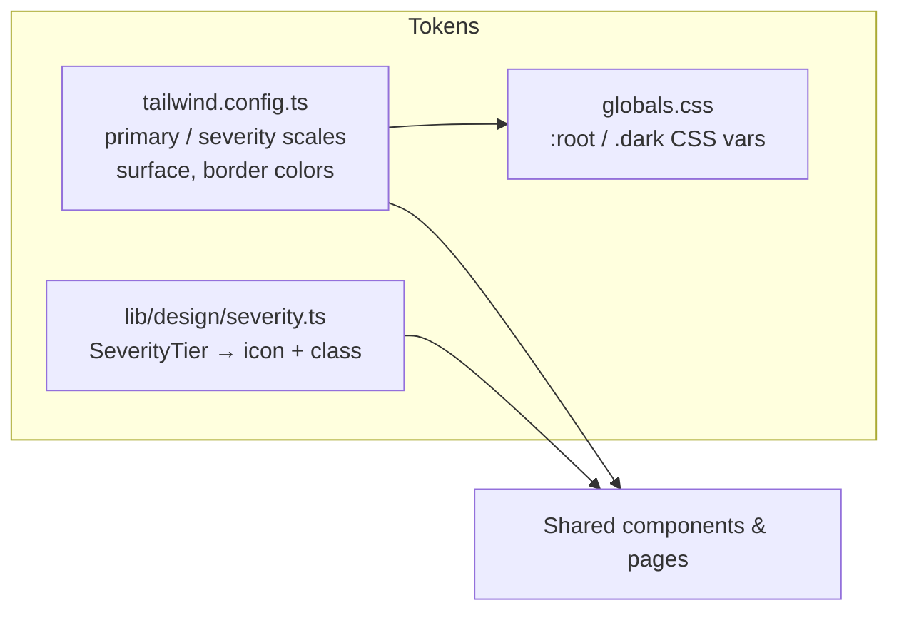
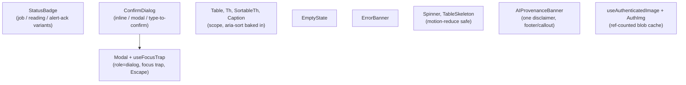
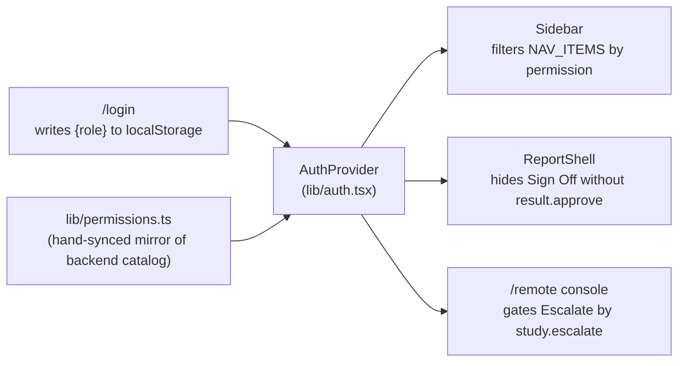
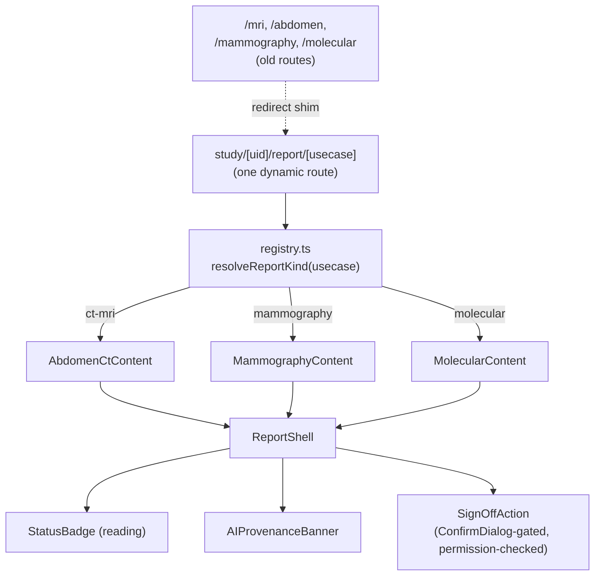
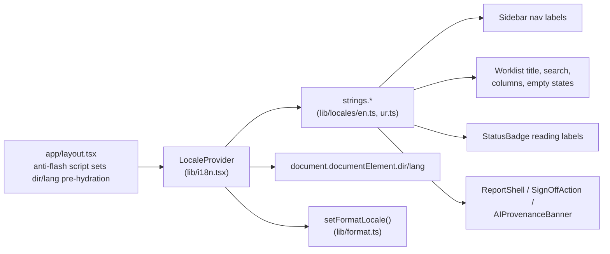

# Frontend Architecture — MR Vision UI Redesign

This documents the design-system and screen architecture introduced during the
UI redesign (`ui/src`). It supersedes the previous ad hoc, per-screen patterns
described in the original redesign brief. Backend architecture is unchanged
except where noted (a few small, additive endpoints — see §6).

## 1. Design token system

Tokens live in two places by necessity: color scales/dark-mode surfaces in
`ui/tailwind.config.ts` + `ui/src/app/globals.css` (Tailwind can statically
extract only literal class names), and the *mapping* from domain concept →
class string + icon in `ui/src/lib/design/severity.ts`.

Five severity tiers exist: `critical / high / moderate / informational / good`
— `good` is a first-class, distinctly-colored tier (not the lightest shade of
a caution color), satisfying the brief's requirement that the scale can
express "trustworthy," not just gradations of risk.

Dark mode is hand-rolled (`lib/theme.tsx`, `ThemeProvider`/`useTheme`) rather
than a new dependency — the only real requirement was toggling a `dark` class
on `<html>` plus an anti-flash inline script in `app/layout.tsx`, which
`next-themes` itself does internally with about the same amount of code.
Coverage: every new Phase 0+ primitive, every screen substantially rebuilt in
Phases 1–3, plus a scripted, additive sweep (`dark:` companions for the ~15
most common light-mode utility classes) across the 14 remaining pages that
had none. The sweep is mechanical, not pixel-audited — treat it as "no glaring
white cards in dark mode," not a full contrast QA pass.

## 2. Shared component library

All primitives live under `ui/src/components/ui/`. Existing domain components
stay flat under `ui/src/components/`.

`StatusBadge` replaced 7 previously-diverging implementations (job-status
badge, 5 separately-coded reading-status pills, and `admin/alerts`' local
`StatusBadge` that shadowed the shared component's name). `useAuthenticatedImage`
replaced 2 of the 3 duplicated JWT-blob-fetch implementations
(`ReportView.tsx`, `ComparePanel.tsx`). **`FusedViewer.tsx`'s cache was left
untouched on purpose** — its slice-scrubbing/prefetch/PET-CT cache-busting
logic is correctness-sensitive in a way that made blind unification a real
clinical-risk, not a cosmetic one; it needs its own dedicated, manually
verified migration later.

## 3. Role / permission model

There is no `/auth/me` permissions endpoint yet — login returns only a role
string. The frontend mirrors the backend's real RBAC catalog
(`backend/app/domain/permissions.py`) by hand in `ui/src/lib/permissions.ts`,
gated through `ui/src/lib/auth.tsx` (`AuthProvider`/`useAuth()`).

`study.escalate` is a new, narrow permission (backend + frontend) added
specifically so the `technician` role — the "local technologist at a site
with no on-site radiologist" persona — can trigger the existing
load-balanced auto-assign endpoint without gaining the broader `study.claim`
(self-claim / reassign) capability. Migration `026` backfills it onto
already-seeded role rows, since the system-role seed (migration `016`) is a
one-time INSERT, not a reconciled-on-startup process.

## 4. Unified report shell

Four independently-built narrative report components (`MriReport`,
`AbdomenCtReport`, `MammographyReport`, `MolecularReport`) are now three live
content renderers behind one shell and a usecase → kind registry.
**`MriReport.tsx` was deleted** — it was confirmed unreachable dead code (no
link anywhere in the frontend or backend ever pointed to it; `AbdomenCtReport`
already handled every CT + MRI use case, including the ones `MriReport`
appeared to target, via the same `ctReport.ts` region metadata).

`ReportShell` deliberately does **not** force a single generic demographics
table or signatory shape onto all three content renderers — they are
genuinely different data (Mammography's 3-column hospital patient table vs.
Mri/AbdomenCt's 2-column table vs. Molecular's dual-signatory footer), not
just styling. The shell owns what's actually shared: outer document wrapper,
toolbar row, banner placement, and the sign-off action.

`DiffView` (AI-generated vs. clinician-edited text) exists as a contract-only
component, intentionally **not wired into ReportShell** — no backend field
anywhere stores an edited-text variant for any report today (verified; the
one candidate, the mammography-report entity, is a mutually-exclusive manual
authoring path, not an edit-tracking mechanism). It renders "no edits
recorded" until a real `report_edits` entity + endpoint exists as a follow-up.

## 5. Delivery status & Remote-site mode

Two new screens, both scoped strictly to what's actually implemented:

- **`/study/[uid]/delivery`** — shows real state (active/expired/revoked,
  creator, expiry) for the one delivery channel that exists end-to-end today:
  the referring-physician portal share link. Backed by two new endpoints
  (`GET /results/{id}/shares`, `POST /portal/shares/{id}/revoke`) exposing a
  service layer (`PortalService`) that already had the logic, just no route.
  DICOM-SR, FHIR, RIS/HIS, and WhatsApp are listed explicitly as
  "Not available" — no fabricated controls for channels that don't exist.
- **`/remote`** — a console for a site with no on-site radiologist: studies
  awaiting a reader, sorted by urgency, with an "Escalate" action gated by
  `study.escalate` and explicit "Radiologist only" messaging for roles
  (technician, receptionist, viewer) that lack `result.approve`/`study.claim`.

## 6. Backend changes made during this pass

All additive, non-breaking — no existing endpoint's request/response shape
changed:

| Change | File(s) | Why |
|---|---|---|
| `RoutingService.get_site_overrides()` + `site_overrides` field on `GET /admin/routing-rules` | `routing_service.py`, `usecase.py`, `admin.py` | The merged effective-rules view can't be reversed into "just the overrides" — the routing-rules editor literally could not load current state without this. |
| `GET /results/{id}/shares`, `POST /portal/shares/{id}/revoke` | `results.py` | `PortalService` already implemented `list_links_for_result`/`revoke_link`; no route ever exposed them. |
| `study.escalate` permission (+ migration `026`) | `permissions.py`, `reading.py`, `026_study_escalate_permission.py` | `auto-assign` required `study.claim`, which `technician` doesn't have — the Remote-site screen's core action was otherwise impossible for the role it's designed for. |

## 7. Internationalization / RTL scaffolding

Scoped to the primary clinical flow (nav → Worklist → Study Reader → Report),
per the brief — not a full-app translation pass.

`dir="rtl"` on `<html>` mirrors the gross layout (sidebar/main) automatically
via the browser's flex-direction behavior in RTL contexts — no extra CSS
needed there. Directional icons (Sidebar's collapse toggle) and physical
inset/padding utilities in Worklist's search bar were converted to Tailwind's
`rtl:`/logical (`ps-`/`pe-`/`start-`) equivalents as a demonstrated pattern,
not swept across the whole app.

**Known scaffolding limitation**: `lib/format.ts`'s `formatDate`/`formatDateTime`
read a module-level `activeLocale` variable rather than reactive context state,
so already-rendered date strings don't retroactively re-render in Urdu locale
formatting on toggle without some other state change triggering a re-render.
Acceptable for a scaffolding pass; would need `formatDate` to become a
locale-aware hook for full reactivity.

## 8. Date/time formatting

The backend returns UTC datetimes without a timezone suffix (e.g.
`"2026-06-08T17:06:39"`). `JavaScript`'s `Date()` parses a timezone-less string
as **local** time, so every such timestamp previously rendered offset by the
viewer's own UTC offset — Worklist had already worked around this locally
(`toUtcMs`) but `lib/format.ts`'s shared `formatDate`/`formatDateTime` (used
by most other screens) had not. `lib/format.ts` now exports `parseUtcDate()`
as the one normalization point; Worklist's local helper now delegates to it
instead of keeping a second copy.

## 9. What's still open (deferred, not silently dropped)

- `FusedViewer.tsx`'s authenticated-image cache — needs its own dedicated,
  manually-verified migration (see §2).
- `report_edits` entity + endpoint for real AI-vs-clinician-edit diffing (see §4).
- Full i18n coverage beyond the primary clinical flow; full logical-CSS-property
  sweep beyond the files touched for the RTL demonstration (see §7).
- `admin/sites` route remains a redirect to `/settings` — it isn't linked from
  any nav item, and `/settings` already surfaces site config (read-only); no
  new site-config editor was built for an unlinked route.
